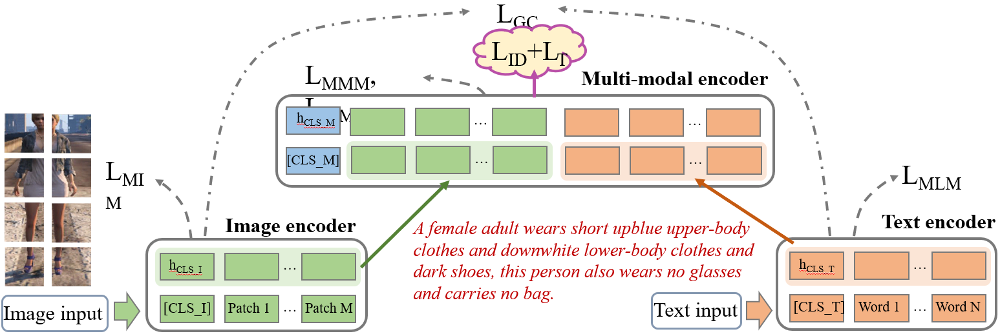

# Learning Robust Visual-Semantic Embedding for Generalizable Person Re-identification

## Introduction

In this paper, we propose a Multi-Modal Equivalent Transformer called MMET for more robust  visual-semantic embedding learning on visual, textual and visual-textual tasks respectively. To further enhance the robust feature learning in the context of transformer, a dynamic masking mechanism called Masked Multimodal Modeling  strategy (MMM) is introduced to mask boththe image patches and the text tokens, which can jointly works on multimodal or unimodal data and significantly boost the performance of generalizable person Re-ID.




## Installation

TorchMultimodal requires Python >= 3.7. The library can be installed with or without CUDA support.
The following assumes conda is installed.

### Prerequisites
1. Install conda environment

    ```
    conda create -n torch-multimodal python=\<python_version\>
    conda activate torch-multimodal
    ```

2. Install pytorch, torchvision, and torchtext. See [PyTorch documentation](https://pytorch.org/get-started/locally/).

    ```
    # Use the current CUDA version as seen [here](https://pytorch.org/get-started/locally/)
    # Select the nightly Pytorch build, Linux as the OS, and conda. Pick the most recent CUDA version.
    conda install pytorch torchvision torchtext pytorch-cuda=\<cuda_version\> -c pytorch-nightly -c nvidia

    # For CPU-only install
    conda install pytorch torchvision torchtext cpuonly -c pytorch-nightly
    ```

### Install from binaries

Nightly binary on Linux for Python 3.7, 3.8 and 3.9 can be installed via pip wheels.
For now we only support Linux platform through [PyPI](https://pypi.org/).

```
python -m pip install torchmultimodal-nightly
```

### Building from Source

Alternatively, you can also build from our source code and run our [examples](https://github.com/facebookresearch/multimodal/tree/main/examples):

```
git clone --recursive https://github.com/facebookresearch/multimodal.git multimodal
cd multimodal

pip install -e .
```
For developers please follow the [development installation](https://github.com/facebookresearch/multimodal/blob/main/CONTRIBUTING.md#development-installation).

## Documentation

The library builds on the following concepts:
- **Architectures**: These are general and composable classes that capture the core logic associated with a family of models. In most cases these take modules as inputs instead of flat arguments (see Models below). Examples include the `LateFusion`, `FLAVA` and `CLIP`. Users should either reuse an existing architecture or a contribute a new one. We avoid inheritance as much as possible.

- **Models**: These are specific instantiations of a given architecture implemented using builder functions. The builder functions take as input all of the parameters for constructing the modules needed to instantiate the architecture. See [cnn_lstm.py](https://github.com/facebookresearch/multimodal/blob/main/examples/cnn_lstm/cnn_lstm.py) for an example.

- **Modules**: These are self-contained components that can be stitched up in various ways to build an architecture. See [lstm_encoder.py](https://github.com/facebookresearch/multimodal/blob/main/examples/cnn_lstm/lstm_encoder.py) as an example.

## Contributing
See the [CONTRIBUTING](CONTRIBUTING.md) file for how to help out.

## License

TorchMultimodal is BSD licensed, as found in the [LICENSE](LICENSE) file.
